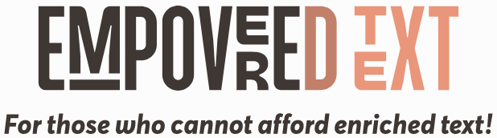

## Purpose
This library is intended to be used to translate a text enriched with some (HTML) tags as specified in the https://en.wikipedia.org/wiki/Enriched_text[enriched text standard] into an _empovered_ one that mocks the effects of the tags leveraging what the https://it.wikipedia.org/wiki/Unicode[Unicode standard] has to offer.

### **Currently supported tags**

* `<strong> / <bold> / <b>`
* `<em> / <italic> / <i>`
* `<ins> / <u>`
* `<del> / <strike> / <s>`
* `<p>`
* `<li>`

### **Tags planned to be supported**
* `<pre> / <code>`
* `<sub>`
* `<sup>`

### Usage

#### Simple example
```groovy
import it.grational.text.TextFilter

String input = "<strong>this is <u>just</u> a <em>sample</em></strong>"
String empoveredText = new TextFilter.EmpoveredText().filter(input)
assert empoveredText == "𝐭𝐡𝐢𝐬 𝐢𝐬 𝐣̲𝐮̲𝐬̲𝐭̲ 𝐚 𝒔𝒂𝒎𝒑𝒍𝒆"
```

#### Extensive layout and formatting example

```groovy
String input = """\
|  <p><strong>Informazioni Azienda <em>ENZA <u>BUTTIGLIERI</u></em> S.A.S. DI <u>VINCENZA BUTTIGLIERI E C.</u></strong></p>
|  <p>L'azienda&nbsp;ENZA BUTTIGLIERI S.A.S. DI VINCENZA BUTTIGLIERI E C., con partita IVA <strong>01639160090</strong> e codice fiscale <em>italico <u>01639160090</u></em>, ha come attivit\u00e0 prevalente Servizi dei saloni di barbiere e parrucchiere ed \u00e8 registrata con il codice Ateco prevalente: 96.02.01. L'ultimo fatturato disponibile \u00e8 del [anno] ed \u00e8 di {fatturato}. La sua forma giuridica \u00e8 Societ\u00e0 in accomandita semplice e la sua sede legale si trova in VIA NIELLA 29 R - 17100 SAVONA, in provincia di SV.</p>
|  <p>ENZA BUTTIGLIERI S.A.S. DI VINCENZA BUTTIGLIERI E C. <u>ha raggiunto un fatturat</u>o nel 2021 di \u20ac&nbsp;0&nbsp;e nel 2022 di \u20ac&nbsp;0&nbsp;con una differenza di \u20ac&nbsp;0,00</p>
|  <ul>
|    <li>&nbsp;La&nbsp;<a href="https://www.tuttovisure.it/camera-di-commercio/visura-camerale?param1=visura_camerale_ordine_opzioniProdotto_tipoDiVisura_0&amp;param2=visura_camerale_ordine_opzioniProdotto_visuraSu_0&amp;partitaIva=01639160090&amp;PIvaID=visura_camerale_ordine_datiProdotto_partitaIva/" rel="noopener" target="_blank"><strong>visura camerale</strong></a>&nbsp;per verificare soci, cariche e qualifiche;
|    </li>
|    <li>&nbsp;La&nbsp;<a href="https://www.tuttovisure.it/catasto/visura-catastale?param1=visura_catastale_ordine_opzioniProdotto_visuraPer_2&amp;param2=visura_catastale_ordine_opzioniProdotto_ricerca_0&amp;codiceFiscaleID=visura_catastale_ordine_datiProdotto_codiceFiscaleAzienda&amp;codiceFiscale=01639160090/" rel="noopener" target="_blank"><strong>visura storica</strong></a>, con cui ottenere tutte le modifiche che sono avvenute nel tempo;
|    </li>
|  </ul>""".stripMargin()

String expected = """\
|𝐈𝐧𝐟𝐨𝐫𝐦𝐚𝐳𝐢𝐨𝐧𝐢 𝐀𝐳𝐢𝐞𝐧𝐝𝐚 𝑬𝑵𝒁𝑨 𝑩̲𝑼̲𝑻̲𝑻̲𝑰̲𝑮̲𝑳̲𝑰̲𝑬̲𝑹̲𝑰̲ 𝐒.𝐀.𝐒. 𝐃𝐈 𝐕̲𝐈̲𝐍̲𝐂̲𝐄̲𝐍̲𝐙̲𝐀̲ ̲𝐁̲𝐔̲𝐓̲𝐓̲𝐈̲𝐆̲𝐋̲𝐈̲𝐄̲𝐑̲𝐈̲ ̲𝐄̲ ̲𝐂̲.̲
|
|L'azienda ENZA BUTTIGLIERI S.A.S. DI VINCENZA BUTTIGLIERI E C., con partita IVA 𝟎𝟏𝟔𝟑𝟗𝟏𝟔𝟎𝟎𝟗𝟎 e codice fiscale 𝑖𝑡𝑎𝑙𝑖𝑐𝑜 0̲1̲6̲3̲9̲1̲6̲0̲0̲9̲0̲, ha come attività prevalente Servizi dei saloni di barbiere e parrucchiere ed è registrata con il codice Ateco prevalente: 96.02.01. L'ultimo fatturato disponibile è del [anno] ed è di {fatturato}. La sua forma giuridica è Società in accomandita semplice e la sua sede legale si trova in VIA NIELLA 29 R - 17100 SAVONA, in provincia di SV.
|
|ENZA BUTTIGLIERI S.A.S. DI VINCENZA BUTTIGLIERI E C. h̲a̲ ̲r̲a̲g̲g̲i̲u̲n̲t̲o̲ ̲u̲n̲ ̲f̲a̲t̲t̲u̲r̲a̲t̲o nel 2021 di € 0 e nel 2022 di € 0 con una differenza di € 0,00
|
| • La 𝐯𝐢𝐬𝐮𝐫𝐚 𝐜𝐚𝐦𝐞𝐫𝐚𝐥𝐞 per verificare soci, cariche e qualifiche;
|
| • La 𝐯𝐢𝐬𝐮𝐫𝐚 𝐬𝐭𝐨𝐫𝐢𝐜𝐚, con cui ottenere tutte le modifiche che sono avvenute nel tempo;""".stripMargin()

assert new TextFilter.EmpoveredText().filter(input) == expected
```

#### Extensive layout only example

```groovy
String beautified = """\
|  <p><strong>Informazioni Azienda <em>ENZA <u>BUTTIGLIERI</u></em> S.A.S. DI <u>VINCENZA BUTTIGLIERI E C.</u></strong></p>
|  <p>L'azienda&nbsp;ENZA BUTTIGLIERI S.A.S. DI VINCENZA BUTTIGLIERI E C., con partita IVA <strong>01639160090</strong> e codice fiscale <em>italico <u>01639160090</u></em>, ha come attivit\u00e0 prevalente Servizi dei saloni di barbiere e parrucchiere ed \u00e8 registrata con il codice Ateco prevalente: 96.02.01. L'ultimo fatturato disponibile \u00e8 del [anno] ed \u00e8 di {fatturato}. La sua forma giuridica \u00e8 Societ\u00e0 in accomandita semplice e la sua sede legale si trova in VIA NIELLA 29 R - 17100 SAVONA, in provincia di SV.</p>
|  <p>ENZA BUTTIGLIERI S.A.S. DI VINCENZA BUTTIGLIERI E C. <u>ha raggiunto un fatturat</u>o nel 2021 di \u20ac&nbsp;0&nbsp;e nel 2022 di \u20ac&nbsp;0&nbsp;con una differenza di \u20ac&nbsp;0,00</p>
|  <ul>
|    <li>&nbsp;La&nbsp;<a href="https://www.tuttovisure.it/camera-di-commercio/visura-camerale?param1=visura_camerale_ordine_opzioniProdotto_tipoDiVisura_0&amp;param2=visura_camerale_ordine_opzioniProdotto_visuraSu_0&amp;partitaIva=01639160090&amp;PIvaID=visura_camerale_ordine_datiProdotto_partitaIva/" rel="noopener" target="_blank"><strong>visura camerale</strong></a>&nbsp;per verificare soci, cariche e qualifiche;
|    </li>
|    <li>&nbsp;La&nbsp;<a href="https://www.tuttovisure.it/catasto/visura-catastale?param1=visura_catastale_ordine_opzioniProdotto_visuraPer_2&amp;param2=visura_catastale_ordine_opzioniProdotto_ricerca_0&amp;codiceFiscaleID=visura_catastale_ordine_datiProdotto_codiceFiscaleAzienda&amp;codiceFiscale=01639160090/" rel="noopener" target="_blank"><strong>visura storica</strong></a>, con cui ottenere tutte le modifiche che sono avvenute nel tempo;
|    </li>
|  </ul>""".stripMargin()

String expected = """\
|Informazioni Azienda ENZA BUTTIGLIERI S.A.S. DI VINCENZA BUTTIGLIERI E C.
|
|L'azienda ENZA BUTTIGLIERI S.A.S. DI VINCENZA BUTTIGLIERI E C., con partita IVA 01639160090 e codice fiscale italico 01639160090, ha come attività prevalente Servizi dei saloni di barbiere e parrucchiere ed è registrata con il codice Ateco prevalente: 96.02.01. L'ultimo fatturato disponibile è del [anno] ed è di {fatturato}. La sua forma giuridica è Società in accomandita semplice e la sua sede legale si trova in VIA NIELLA 29 R - 17100 SAVONA, in provincia di SV.
|
|ENZA BUTTIGLIERI S.A.S. DI VINCENZA BUTTIGLIERI E C. ha raggiunto un fatturato nel 2021 di € 0 e nel 2022 di € 0 con una differenza di € 0,00
|
| * La visura camerale per verificare soci, cariche e qualifiche;
|
| * La visura storica, con cui ottenere tutte le modifiche che sono avvenute nel tempo;""".stripMargin()

assert new TextFilter.LaidOutText().filter(input) == expected
```
